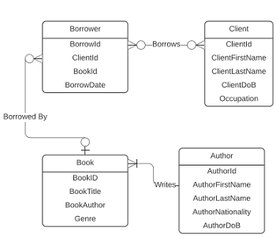

In this project you will build a database for a public library. This database is aimed to collect and analyze information about the clients' reading interests. The project concentrates only on books and the clients' interests in books. The analyses that will result from this project will be used by the library's management to decide on the future purchasing policy.

A. Write the SQL statements in order to create the tables for the database. Use the Entity Relationship Diagram (ERD) of the database shown in Figure 1. For simplicity, we are assuming in this project that a book cannot be written by more than one author. You need to create the tables as well as the required constraints, including the keys (primary and foreign), and the relationships between tables.

B. Populate your database with the sample set of data given to you in the tables below the assignment prompts.

C. Write the following queries to retrieve the information detailed below.

- Display all contents of the Clients table
- First names, last names, ages and occupations of all clients
- First and last names of clients that borrowed books in March 2018
- First and last names of the top 5 authors clients borrowed in 2017
- Least 5 author nationalities clients borrowed during the years 2015-2017
- The book that was most borrowed during the years 2015-2017
- Top borrowed genres for client born in years 1970-1980
- Top 5 occupations that borrowed the most in 2016
- Average number of borrowed books by job title
- Create a VIEW and display the titles that were borrowed by at least 20% of clients
- The top month of borrows in 2017
- Average number of borrows by age
- The oldest and the youngest clients of the library
- First and last names of authors that wrote books in more than one genre

As you work on these queries, create indexes that will increase your queries' performance.

You must include comments in your code that address the purpose of your query and explains each step. Save your queries and results in a plain-text file that you will submit as your assignment.